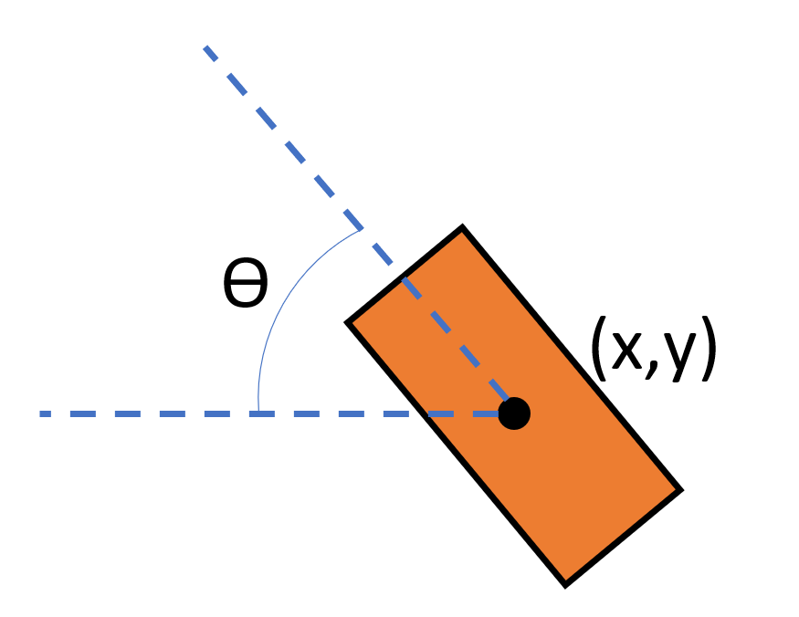

User Input
========================

Overview
------------------------
(EDIT LATER) We want to take user input for the start and end positions of the path

Code overview
------------------------
We determine the start and end points by creating a listener for the left and right arms. A tranform listener is first initialised with a rate of 10 refreshes per second.

    def get_coordinates():
        listener = tf.TransformListener()
        rate = rospy.Rate(10.0)
        
For our pusposes, we only need the x,y coordinates (to determine where on the table it will be positioned) and the yaw angle (to determine the placement orientation).

   
As such, we use the lookupTransform function from the tf module, allowing us to determine the translation and rotation of each end effector relative to the base.

    try:
        (l_trans,l_rot) = listener.lookupTransform('left_gripper', 'base', rospy.Time(0))
        print l_trans,l_rot
        (r_trans,r_rot) = listener.lookupTransform('right_gripper', 'base', rospy.Time(0))
    except (tf.LookupException, tf.ConnectivityException, tf.ExtrapolationException):
        continue
        
We only want to record the coordinates and orientation when the user is ready, so the program waits until it recieves user input:

    if ready == 'Y':
        arm = raw_input('Which arm are you looking for? [L/R]: ').upper()
        if arm == "L":
            trans, rot = l_trans, l_rot
        else:
            trans, rot = r_trans, r_rot
            
Finally, we want to convert these angles from quaternions to radians for the sake of readibility

    Angle = tf.transformations.euler_from_quaternion(rot)
    translations.append(trans)
    angles.append(tf.transformations.euler_from_quaternion(rot)
    
These values for the start and end positions are now ready to produce a bezier curve!
