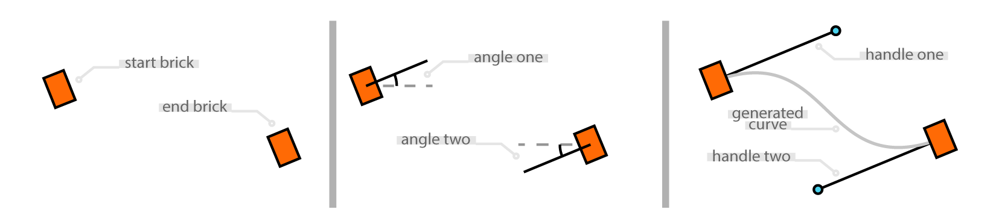
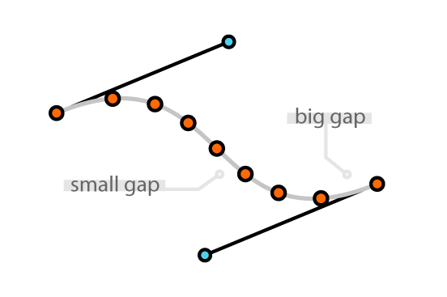

Bezier Curve
============
In order to solve the problem of generating a dynamic placement path for the dominoes the Bezier format of representing curves was ideal. 

[insert gif of adaptive path control]

The ability to generate different curves based upon two positions and orientaions was well suited to our project. Additionally the abilty to adjust how much influence the start and end orientations have on the curve proved very helpful when automating the adaption of the curve if an inverse kinematics solution couldn't be found. 

The implementation for this part of the project is split into two python files, ``bezier_conversion.py`` and ``bezier_interpolation.py``. Where bezier conversion contains the code that defines the Bezier class we created and bezier interpolation uses this class, and the placed brick positions to generate the positions and orientations of the bricks go inbetween.

T - Space vs Cartesian Space
----------------------------
Beziers work by converting a value from 0 and 1 into x and y coordinates. They're defined by 4 control points.

[insert image of control points]

These control points are used in the following equation:

.. math:: B(t)=\sum_{i=0}^{n} {}_n \mathrm{ C }_i (1-t)^{n-i} t^{i} P_{i}

Representing a Bezier in Code
-----------------------------
All of the code in this section is from the ``bezier_conversion.py`` file. The line numbers of the following code snippets correspond to their position within this file. 

The Bezier Class
^^^^^^^^^^^^^^^^
We chose to create a new Bezier object type, to make it more intuitive to work with the Beziers within the code.

The instantiation of a Bezier object takes a string input which can be copied from xml generated by graphics packages such as Adobe Illustrator or Inkscape. 

.. literalinclude:: dominoes_code/bezier_conversion.py
   :language: python
   :pyobject: Bezier.__init__
   :linenos:
   :lineno-start: 11

NOTE: Alternatively you can easily construct your own string, as it is essentially just a list of coordinates in the following format:

Conversion
^^^^^^^^^^^
The conversion method is called during the instantiation of a Bezier object. It iterates through the characters in the inputted string and extracts the coordinates from it.

These coordinates are converted into ``Node`` objects. The node class is very simple, it has two attribute: x and y. It has no methods other than ``__init__``.

.. literalinclude:: dominoes_code/bezier_conversion.py
   :language: python
   :pyobject: Node
   :linenos:
   :lineno-start: 3

Each ``Node`` object is then appended to a list stored in the ``Bezier`` attribute ``p``. The reason this attribute is called p and not something more explanatory such as point list, is to allow the later functions to read more like the bezier equation outlined above. For example referencing point :math:`P_2` can be done using ``Bezier.p[2]`` which reads very similarly making the code more legible.

.. literalinclude:: dominoes_code/bezier_conversion.py
   :language: python
   :pyobject: Bezier.conversion
   :linenos:
   :lineno-start: 16
   
B_x
^^^
This method takes a t value and returns the corresponding x coordinate. The variables ``c0`` - ``c1`` are the different sections of the expanded form of the Bezier equation shown above.

.. literalinclude:: dominoes_code/bezier_conversion.py
   :language: python
   :pyobject: Bezier.B_x
   :linenos:
   :lineno-start: 59

The code is the equvilent of the following mathematical expression:

.. math:: B_x(t)=(1-t)^{3} P_{0x} + 3(1-t)^{2} t P_{1x} + 3(1-t) t^{2} P_{2x} + t^{3} P_{3x}

B_y
^^^
This method takes a t value and returns the corresponding y coordinate. The variables ``c0`` - ``c1`` are the different sections of the expanded form of the Bezier equation shown above.

.. literalinclude:: dominoes_code/bezier_conversion.py
   :language: python
   :pyobject: Bezier.B_y
   :linenos:
   :lineno-start: 66

The code is the equvilent of the following mathematical expression:

.. math:: B_y(t)=(1-t)^{3} P_{0y} + 3(1-t)^{2} t P_{1y} + 3(1-t) t^{2} P_{2y} + t^{3} P_{3y}

Creating a Bezier from the Start and End Bricks
-----------------------------------------------
The code descibed below is all from the ``bezier_interpolation.py`` script unless otherwise stated. This function defined in this script takes the placed brick's positions and orientations and returns a list of poses for all the bricks that need to be placed inbetween them.

In order to use the Bezier class, ``bezier_conversion.py`` is imported at the beginning of the code.

.. literalinclude:: dominoes_code/bezier_interpolation.py
   :language: python
   :lines: 2
   :linenos:
   :lineno-start: 2

The coordinates and brick rotation are fed into the ``create_path`` function from the main ``right_placement.py`` script.

This information is used to generate a curve.

The positioning of the control points
^^^^^^^^^^^^^^^^^^^^^^^^^^^^^^^^^^^^^
:math: `P_0` and :math: `P_3` are simply the start and end coordinates fed into the function. However working our where :math: `P_1` and :math: `P_2` should be takes a little bit more work. 

The angle of rotation, plus the variable handle influence variable are used to calculate the change in x and change in y from the start and end position with some simple trigonometry.

.. literalinclude:: dominoes_code/bezier_interpolation.py
   :language: python
   :lines: 13-37
   :linenos:
   :lineno-start: 13

These coordinates are then fed into a string variable called ``bezier_string`` which is consitent with the XML standard for representing Bezier curves. The variable ``bezier_string`` is passed as an argument in the instantiation of a new Bezier object. This means that we can now calculate the x and y coordinates of every point along the generated path by calling ``brick_path.B_x(t)`` and ``brick_path.B_y(t)``.

.. literalinclude:: dominoes_code/bezier_interpolation.py
   :language: python
   :lines: 39 - 41
   :linenos:
   :lineno-start: 39

Evenly Spacing the Bricks
-------------------------
Evenly Spaced t Values
^^^^^^^^^^^^^^^^^^^^^^

It would seem intuitive that if you wanted to evenly place 9 bricks along the path then you would increment the t value in 8 even steps.

.. highlight:: python
::
   for i in range(9):
      t = i * (1/8)
      x = brick_path.B_x(t)
      y = brick_path.B_y(t)

However due to the relationship t has to the curvature of the path, you actually get something that looks more like this.

And whilst it is good enough for creating a nice pattern, in the case of dominoes, you need to be able to specify how far apart they are spaced so you know that they will knock each other over.

Approximating the Length of a Bezier
^^^^^^^^^^^^^^^^^^^^^^^^^^^^^^^^^^^^
The easiest way to evenly space the points along the bezier would be to divide the bezier's length by the design number of bricks. However there is no mathematically simple way to calculate this accurately. Therefore an approximation of the length of the bezier has been used instead.

Utilizing Memoisation to Improve Efficiency
^^^^^^^^^^^^^^^^^^^^^^^^^^^^^^^^^^^^^^^^^^^

Converting Distance Along Path to Catesean Coordinates
^^^^^^^^^^^^^^^^^^^^^^^^^^^^^^^^^^^^^^^^^^^^^^^^^^^^^^

Rotating the Bricks to be Normal to the Path
---------------------------------------------
Calculating Tangent Line
^^^^^^^^^^^^^^^^^^^^^^^^

Converting to Rotation
^^^^^^^^^^^^^^^^^^^^^^

