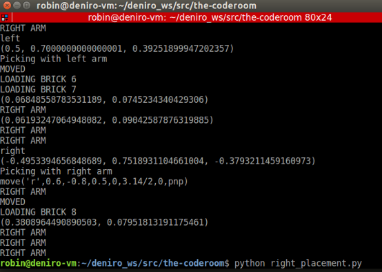

Getting Started
========================

To install and run this projects code on your computer or VM you must:

1. Pull the `the-coderoom`_ repository from Github
2. Follow the instructions below to get the simulation running

We will now walk step by step to go from an empty workspace to a robot that can build a domino path in Gazebo

Instructions
-------------------------

1. Run roscore from a new terminal window.

.. code-block:: console
    
    $ roscore
2. Open a new terminal window and run gazebo

.. code-block:: console
    
    $ roslaunch baxter_world baxter_gazebo
3. Once Gazebo has launched, open a new terminal window and navigate to the folder containing the ``the-coderoom`` repository code.

.. code-block:: console
    
    $ cd the-coderoom/dominoes
4. Finally, run the ``right_placement.py`` script and follow the prompts in the terminal to see the domino placing simulation in action.

.. code-block:: console
    
    $ python right_placement.py

.. _the-coderoom: https://github.com/Van-Goghbot/the-coderoom
