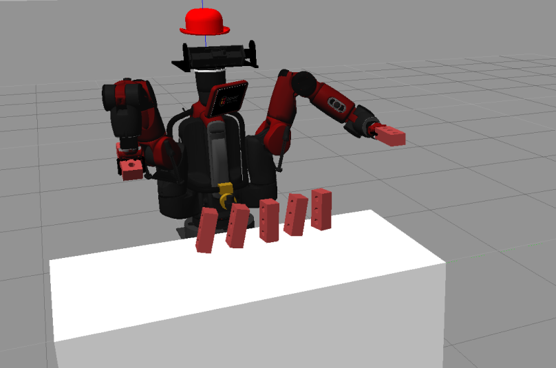

Introduction
========================

Overview
-------------
For the Robotics project, the brief assigned was to apply the 3D kinematics principles learnt in term 1 to program a robot to complete a set task. From the initial brief, the group decided to focus on programming DE-NIRO to create a domino sequence and knowck it down using the given foam bricks. The main steps involved picking the bricks, reorientation the bricks, placing the bricks in a path, and successfully knocking over the bricks. Due to the nature of the robotics projects, this initial high-level structure was broken down further.

The group was initial given the choice between the DE-NIRO and Panda robots. The group decided that DE-NIRO would be the best choice as our desired task required a large workspace that Panda could not reach, and because DE-NIRO has two arms that could enable the sequence to be completed faster.

A unique element of the project was the dynamic arrangement of the bricks along curved Bezier paths. These were implemented using SVG and were based on given start and end coordinates. This allowed a user to interact with the robot and influence how the dominoes could be arranged. Risk minimisation was also implemented to add robustness. This enabled DE-NIRO to place the bricks from the inside out with a delay between the arms to avoid collision.
 
Videos
-------------

`Project overview`_

`Domino placement - Real life`_

`Domino placement - Simulation`_

`Setting up and running code`_

Presentation
-------------

`Presentation slides`_

Github
-------------

`Github repository`_

Contributors
-------------

Amy Mather, Euan Hay, Esther Maltby, Alisa Lomax, Saym Hussain

.. _Github repository: https://github.com/Van-Goghbot
.. _Project overview: https://drive.google.com/file/d/1-CRNby6B7_3nkKOvS4H6r5w4KaBU-2kN/view?usp=sharing
.. _Domino placement - Simulation: https://drive.google.com/open?id=16EYv2J6Ya6HUyTFgOLBw7UTCwGWKd9ai
.. _Domino placement - Real life: https://drive.google.com/file/d/1upAYPv9WAtRqW-wK1cnZig8cDrmZvin2/view?fbclid=IwAR2OWkxUuuH4r3dMeiGpXatqs_VzAjbUqYJ-8Y4pmy0s-TFVt2B1EIfaAgg
.. _Setting up and running code: https://drive.google.com/open?id=164bEFaRacpHIMV_tlWwU3duqRCKpdJvD
.. _Presentation slides: https://imperiallondon-my.sharepoint.com/:p:/r/personal/aem4717_ic_ac_uk/Documents/Robotics%20Animation%20Celebration.pptx?d=w0f6adfd3853f42e49dc6cef74dffe3f8&csf=1&e=LNiWVl
