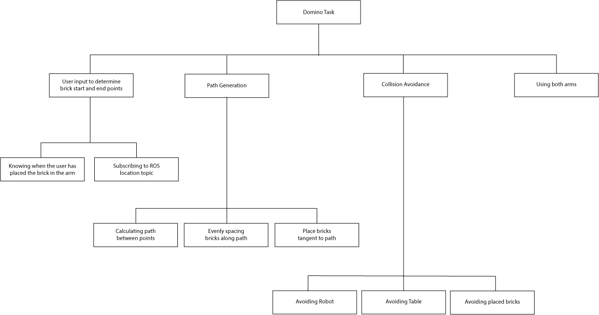

Introduction
========================

.. figure::  imgs/deniro_simulated.png
   :align:   center

Overview
-------------
This project aimed to use 3D Kinematics principles to get a robot to plan and lay out custom domino paths. Foam bricks were used as the dominoes, and we wanted the robot to collaborate with you to decide upon a path, leaving the fun of knocking over the path to you. 

We had a choice of two robots: the Baxter robot and the Panda robot. We decided that Baxter robot, known familiarly as DE-NIRO (Design Engineering Natural Interaction RObot),  would be the best choice as our desired task required a large workspace that the Panda robot could not reach and because DE-NIRO has two arms enabling  the sequence to be completed faster. Risk minimisation was also implemented to add robustness. This enabled DE-NIRO to place the bricks from the inside out with a delay between the arms to avoid collision.

To break the project into a more manageable and organised structure, the different elements of the code were connected as such:

 
Videos
-------------

`Project overview`_

`Domino placement - Real life`_

`Domino placement - Simulation`_

`Setting up and running code`_

Presentation
-------------

`Presentation slides`_

Github
-------------

`Github repository`_

Contributors
-------------

Amy Mather, Euan Hay, Esther Maltby, Alisa Lomax, Saym Hussain

.. _Github repository: https://github.com/Van-Goghbot
.. _Project overview: https://drive.google.com/open?id=1g-9TisHWX9m03OYFH9l2GGtcYhuyJFod
.. _Domino placement - Simulation: https://drive.google.com/file/d/1i8YlybJPy28riKpq7beLlXRQaOJQ-tgj/view?usp=sharing
.. _Domino placement - Real life: https://drive.google.com/file/d/1QDtLKm7E8it-bFPhVYY9rXpznGsEYBhl/view?usp=sharing
.. _Setting up and running code: https://drive.google.com/open?id=1ikvy-zoK48acajkLAyTWm_Xm91PtloFZ
.. _Presentation slides: https://imperiallondon-my.sharepoint.com/:p:/r/personal/aem4717_ic_ac_uk/Documents/Robotics%20Animation%20Celebration.pptx?d=w0f6adfd3853f42e49dc6cef74dffe3f8&csf=1&e=LNiWVl
