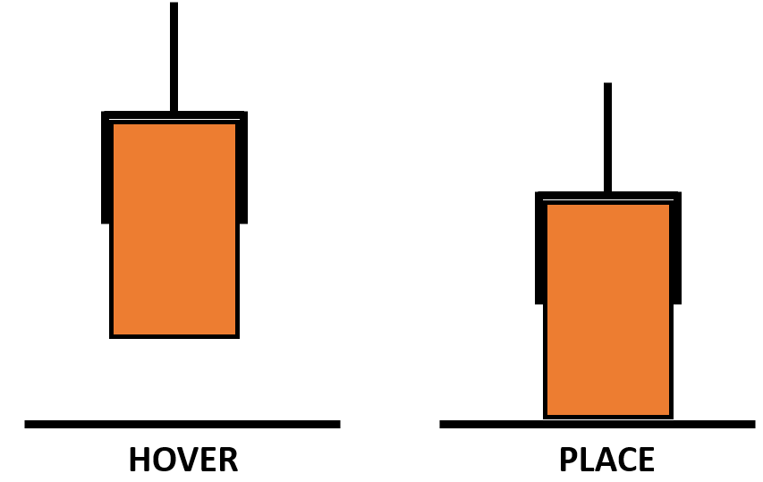
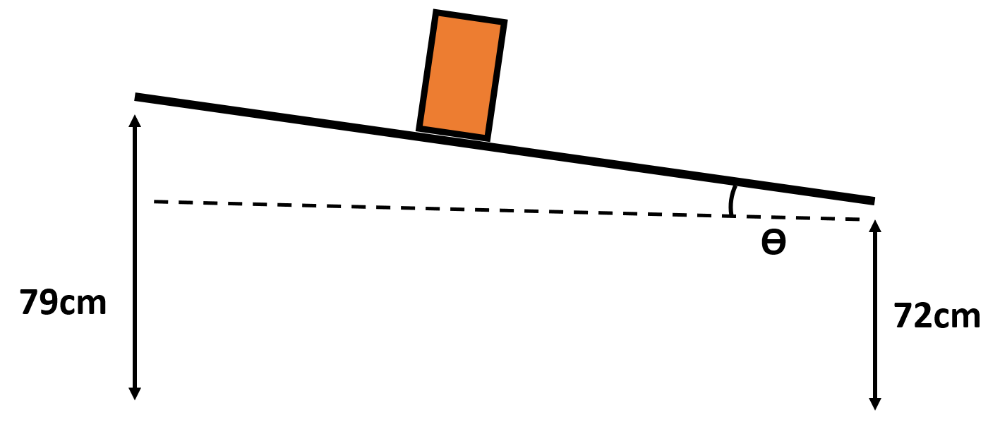

Inverse Kinematics
=====================
Overview
---------------------
If the coordinates are run before checking the inverse, the path may fail half way through. To avoid this, we check the inverse kinematics for each placing point and the hover point above.

   
Code review 1
---------------------
To achieve this, we input the necessary pose and hover distance to check whether there is a feasible set of joint angles.

::
   error_check = domino.ik_test(round(brick.y, 3),round(brick.x, 3),adjusted_z,incline_angle,math.pi,brick.rot,hover,right_pnp,left_pnp)
   
Table slant
---------------------
During testing we found that the bricks wouldn't knock over reliably on a flat surface due to the width of the brick. To counteract this, we instead place the path on a slanted table, allowing the dominoes to be knocked over more easily. We use an adjusted value for z and an incline angle and for the roll so that we can account for the slant of the table. The necessary parameters are setup in ``lines 137-147 of right_placement.py``

   
::
   error_check = domino.ik_test(round(brick.y, 3),round(brick.x, 3),adjusted_z,incline_angle,math.pi,brick.rot,hover,right_pnp,left_pnp)
   
Code review 2
---------------------
