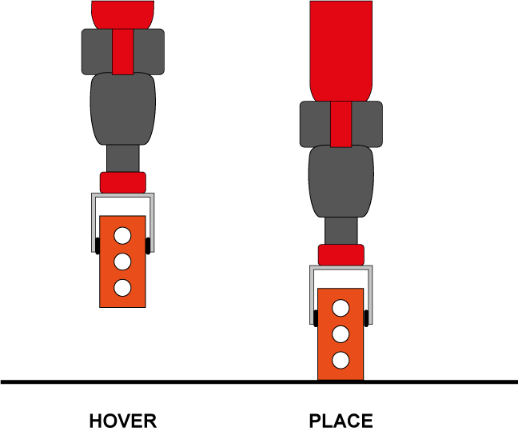

Inverse Kinematics
=====================
Overview
---------------------
If the coordinates are run before checking the inverse, the path may fail half way through. To avoid this, we check the inverse kinematics for each placing point and the hover point above.

   
Inverse kinematics check
---------------------
To achieve this, we input the necessary pose and hover distance to check whether there is a feasible set of joint angles.

::
   error_check = domino.ik_test(round(brick.y, 3),round(brick.x, 3),adjusted_z,incline_angle,math.pi,brick.rot,hover,right_pnp,left_pnp)
::

Table slant
---------------------
During testing we found that the bricks wouldn't knock over reliably on a flat surface due to the width of the brick. To counteract this, we instead place the path on a slanted table, allowing the dominoes to be knocked over more easily. We use an adjusted value for z and an incline angle and for the roll so that we can account for the slant of the table. The necessary parameters are setup in ``lines 137-147 of right_placement.py``

.. figure::  imgs/table_height.png
   :align:   center
   
::
   error_check = domino.ik_test(round(brick.y, 3),round(brick.x, 3),adjusted_z,incline_angle,math.pi,brick.rot,hover,right_pnp,left_pnp)
   
IK Test
---------------------
We must first input the coordinates and orientation as a pose:

..literalinclude:: domino.py
   :lines: 209-225
   
If the coordinate is on the left side, we want to test that with the left side and visa versa with the right arm. If both arms fail for either the hover or place coordinate, the coordinate fails, and so does the current path. 

..literalinclude:: domino.py
   :lines: 162-165
   
If the initial path has failed we have to rerun the path with a straighter path. We do this by adjusting the handles from the bezier code to produce a different path in ``right_placement.py lines 210-224:

::
    while len(check_list) > 0:
        influence -= 10
        run_number += 1
        print("Run number {0} failed".format(str(run_number)))
        coords = bezier_interpolation.create_path(start_x, start_y, start_angle, end_x, end_y, end_angle, influence)
::

If this still doesn't work after 10 tries it means even a straight line won't work. We have to break out of the loop and retry with new start and end positions.

::
     if run_number >= 10:
         break
::

If a path does succeed, we can then go on to pick and place the bricks.
