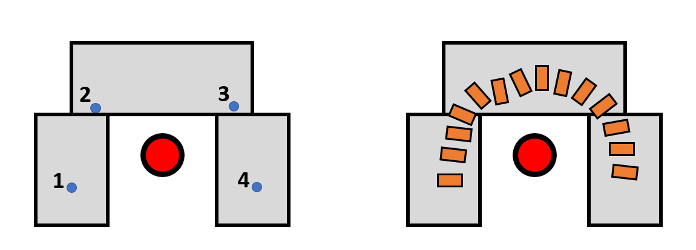

Improvements
======================
Increased workspace
----------------------
DE-NIRO has an very large reachable workspace, which was one of the reasons we chose to use it. In our demonstrations we only used a fraction of that potential workspace. A simple future improvement would be adding more tables to allow for longer, more exciting paths.

   
This would be achieved through adding extra waypoints for the bezier to intersect with; allowing for even more interesting paths.

Multi-threading
----------------------
Whilst our use of the subprocess module was succesful in practice, much of the debugging is clunky and overly complicated. The uasge of mult-threading may be beneficial to the improvement of our implementation.
