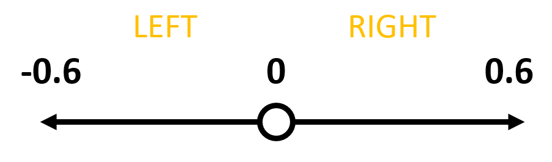

Ordering
====================
Overview
--------------------
The main benefit to oredring the path coordinates is that we can first assign coordinates to either the left or right arm, then we can place the bricks from the centre of the table outwards, preventing the arms from knocking over previously placed bricks.

Code Overview
--------------------
The code for ordering code is relatively simple, we first need to divide the coordinate list into coordinates covered by the left arm and those covered by the right.

.. literalinclude:: dominoes_code/right_placement.py
   :language: python
   :lines: 182
   :linenos:
   :lineno-start: 182

.. literalinclude:: dominoes_code/right_placement.py
   :language: python
   :pyobject: None
   :linenos:
   :lines: 147-153

Both lists need to be sorted into ascending order, the right list is then reversed, arranging the both sets of coordinates around 0.

.. literalinclude:: dominoes_code/right_placement.py
   :language: python
   :pyobject: None
   :linenos:
   :lines: 172-175

