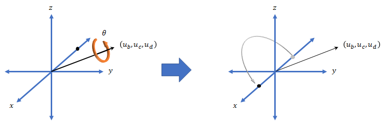
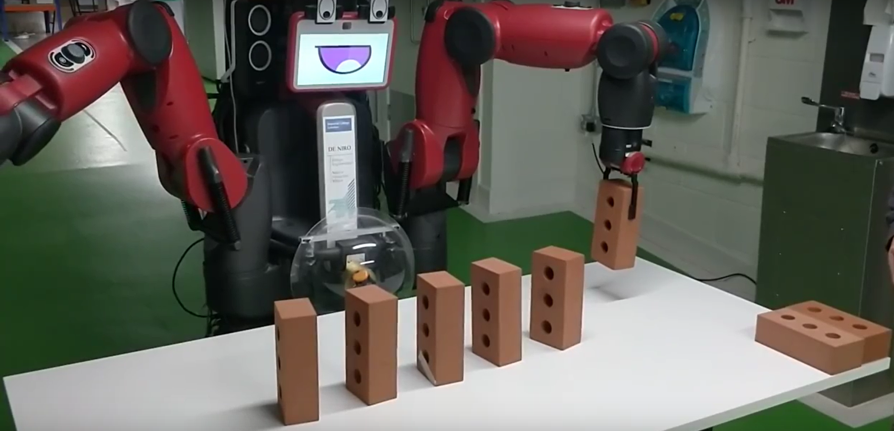

Placing
====================
Motion path
--------------------
From the safe point, we can use the ``move`` function to position the arm at the hover point, above where the brick needs to be placed. The move function takes the desired pose of the robot, checks the inverse kinematics of that final position and then moves. For the pose we first need to convert from euler angles to quaternions.

   
From this hovering position, the arm moves directly down, with the brick almost in contact with the table. Due to the adjustments made previously, the brick will be positioned so that it stands freely on a slanted table. The gripper opens and the brick is released. ``rospy.sleep`` is used to just slightly pause the raising of the arm, as we found through testing that a sudden movement would jostle the position and orientation of the brick. The brick raises to the hover point and then returns to the safe point. This entire process is then repeated for every coordinate passed to the arm.

   
Since we have ordered the code from the inside out, there is no chance that the robot will knock or disrupt the previously placed bricks.
