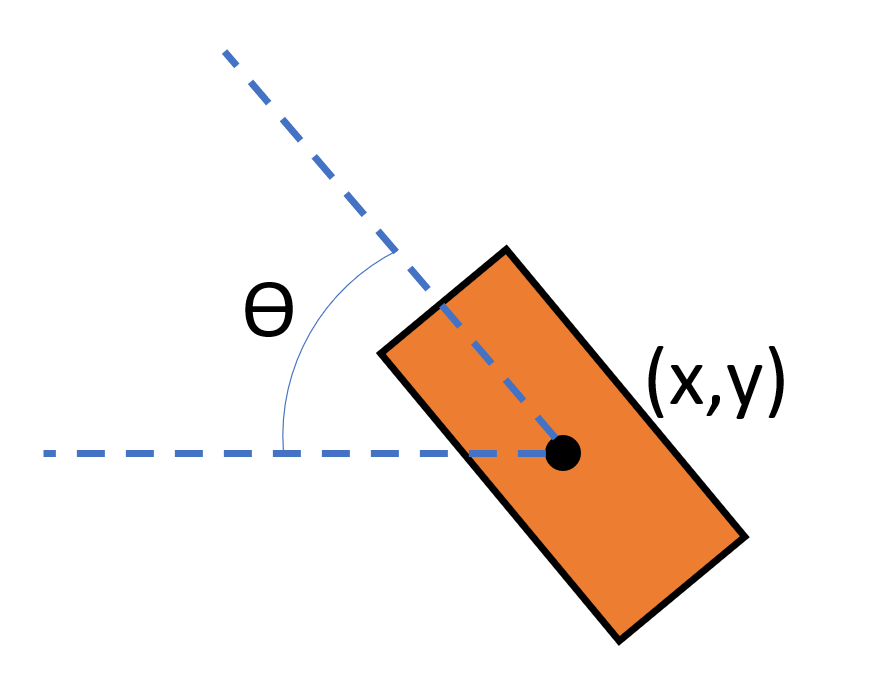

User Input
========================

Overview
------------------------
We want to take user input for the start and end positions of the path which will allow us to define the curve for the dominoes to be placed on.

Code overview
------------------------
We determine the start and end points by creating a listener for the left and right arms. A tranform listener is first initialised with a rate of 10 refreshes per second.

.. literalinclude:: dominoes_code/listener.py
   :language: python
   :lines: 5-8
   :linenos:
   :lineno-start: 5
        
For our pusposes, we only need the x,y coordinates (to determine where on the table it will be positioned) and the yaw angle (to determine the placement orientation).

   
As such, we use the ``lookupTransform`` function from the tf module, allowing us to determine the translation and rotation of each end effector relative to the base.

.. literalinclude:: dominoes_code/listener.py
   :language: python
   :dedent: 2
   :lines: 15-21
   :linenos:
   :lineno-start: 15

We only want to record the coordinates and orientation when the user is ready, so the program waits until it recieves user input:

.. literalinclude:: dominoes_code/listener.py
   :language: python
   :dedent: 2
   :lines: 26-29
   :linenos:
   :lineno-start: 26
            
Finally, we want to convert these angles from quaternions to radians for the sake of readibility

.. literalinclude:: dominoes_code/listener.py
   :language: python
   :dedent: 3
   :lines: 32-37
   :linenos:
   :lineno-start: 32
    
These values for the start and end positions are now ready to produce a bezier curve!
